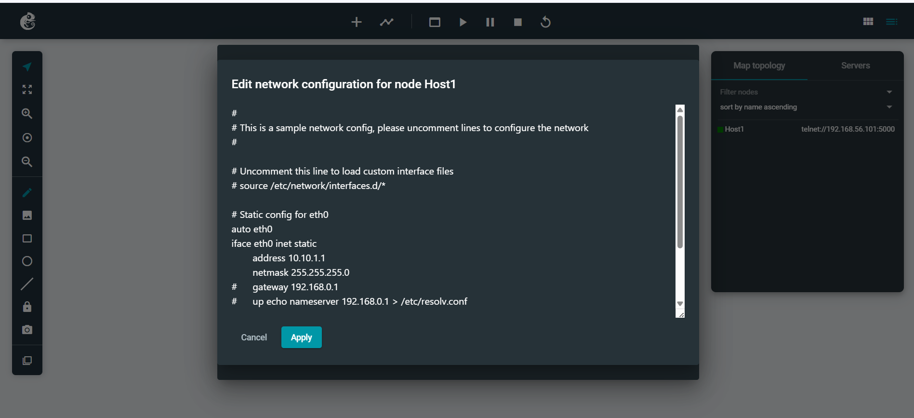
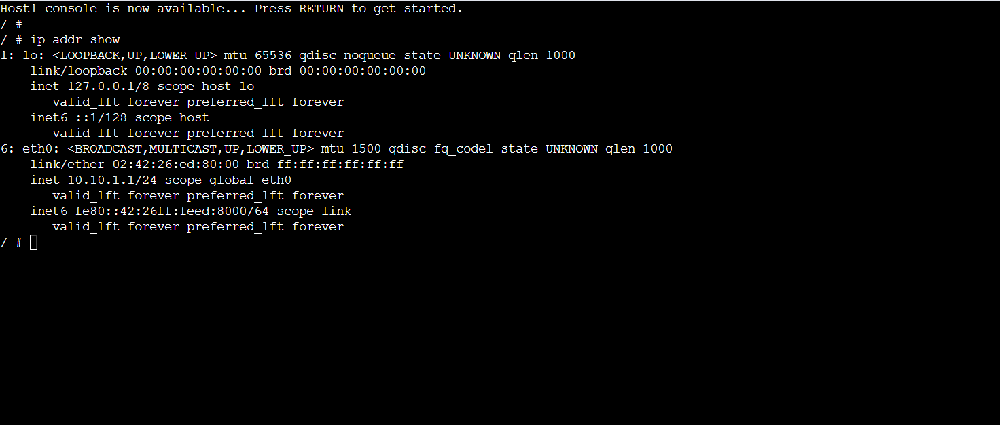

# Week 1

In this week, following tasks were completed:
- A GNS3 project was created, and a Linux host node was added.
- configured with a static IP address using the /etc/network/interfaces file. 
- a web console was used to verify the IP address using Linux commands. 

# GNS3 Intro Project

## Files

- Exported GNS3 project file

  GNS3-Intro-12268374.gns3project

- Network Topology

- IP Address Output
