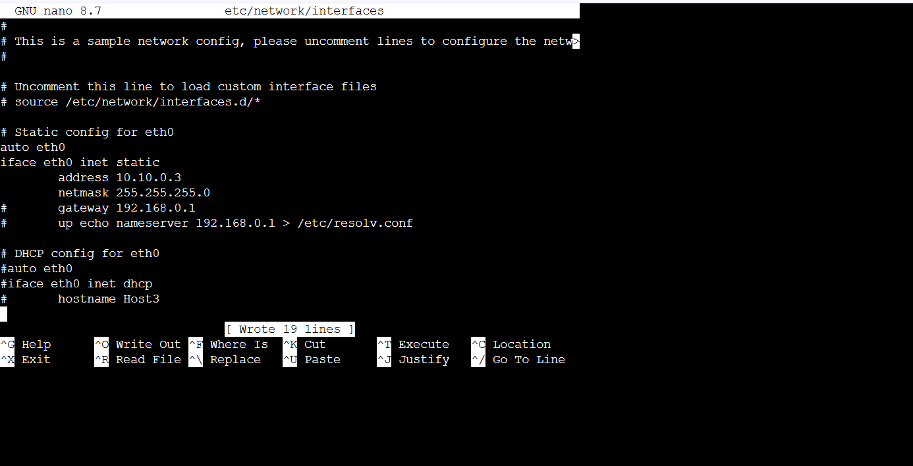
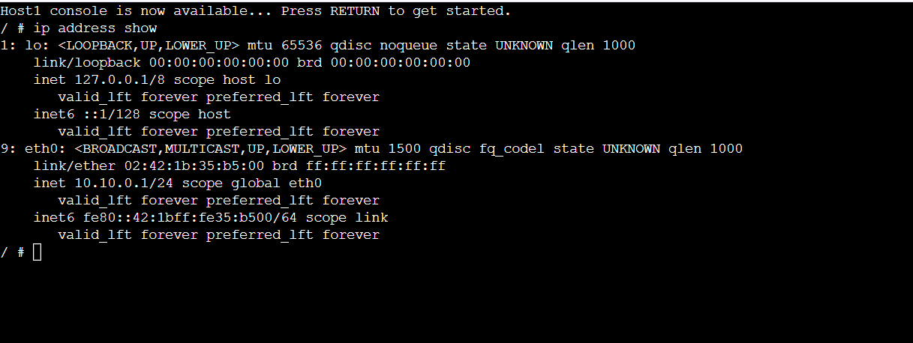
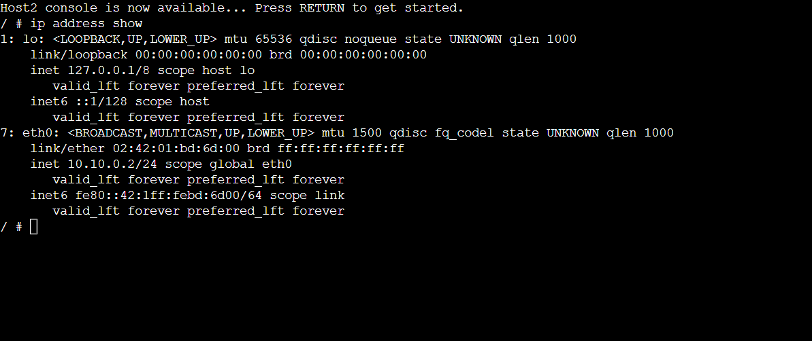
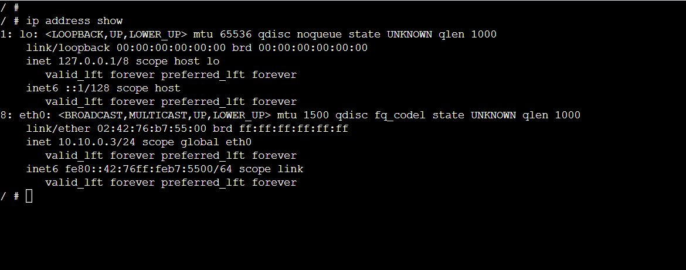
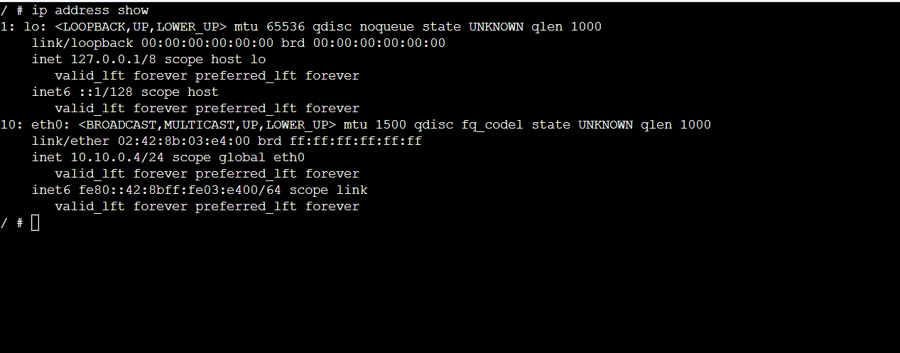
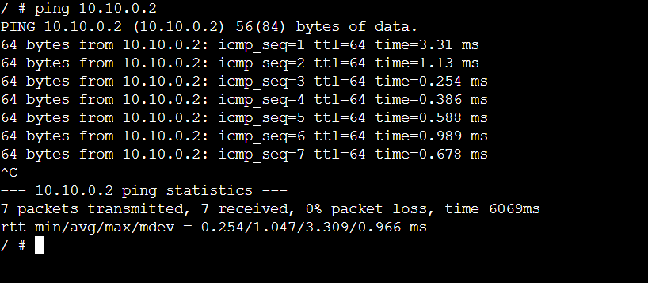
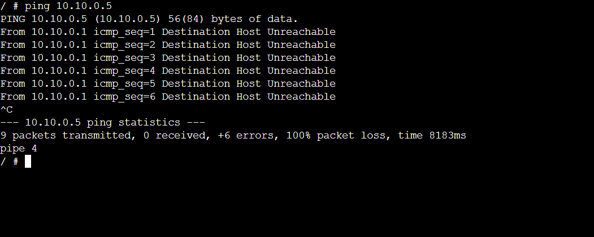
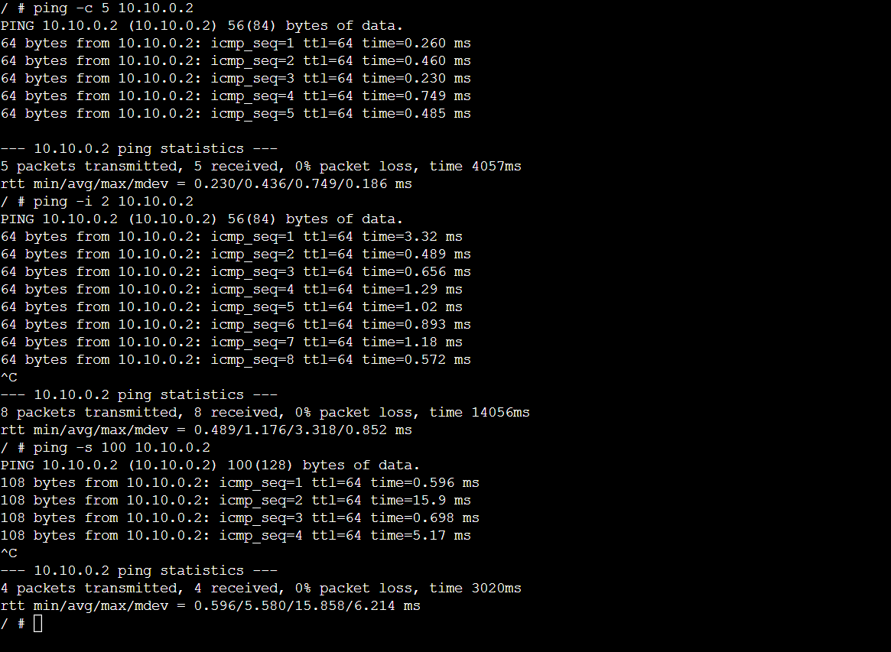

# Week 2
# Setting IP & Ping Basics
In this week, I have worked on two tasks. 

## Task 1:
- A network was created in GNS3 with four Linux hosts and a switch. 
-	Static IP addresses were set using three different methods: GNS3 settings, editing the /etc/network/interfaces file, and using the ip address add command. 
-	All IP addresses were checked using the ip address show command.

## Task 2:
-	Ping was used to test connection between hosts and check if devices are reachable. 
-	The output was observed to understand delay (RTT) and packet loss when pinging both valid and invalid IP addresses. 
-	Different ping options were also tested to see how they affect the results.

## Project Files
- **Setting-IP-<studentid>.gns3project**  
  Exported GNS3 project file.

---

### Network Topology

---

### Host IP Addresses
#### Host 1

#### Host 2

#### Host 3

#### Host 4

---

### Ping Tests

#### Simple Ping

#### Ping to Wrong IP

#### Ping with Options
