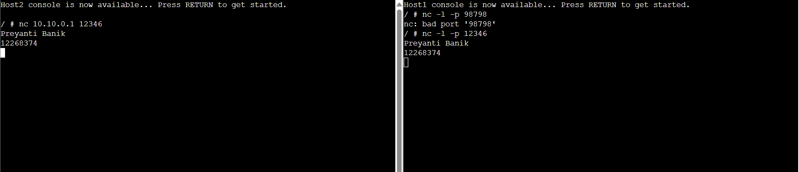

# Week 3
# Netcat & Capturing Packets
In this week, I have worked on two tasks. 

## Task 1:
- Netcat was used to create a simple communication between two hosts. 
-	One host was set as a server and another as a client, and messages like name and student ID were sent between them.

## Task 2:
-	Packets were captured on a network link while using ping and netcat. 
-	The capture was stopped and the file was saved and transferred to the computer.

## Netcat & Packet Capture

### Netcat Communication

---

### Packet Capture File
- **Capture-Basics-12268374-ping-netcat.pcap**  
  Packet capture file containing ping and netcat traffic.