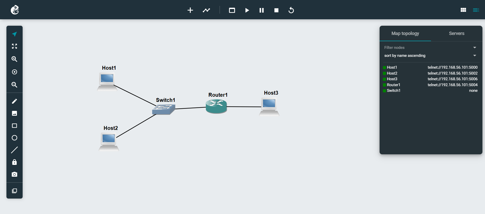
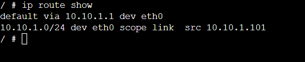
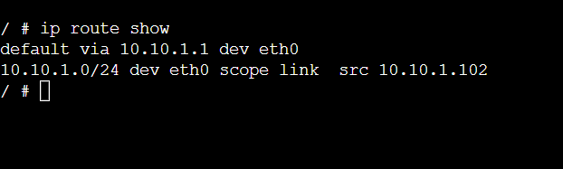
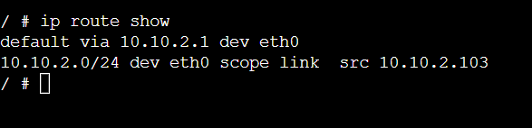
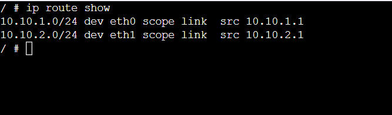
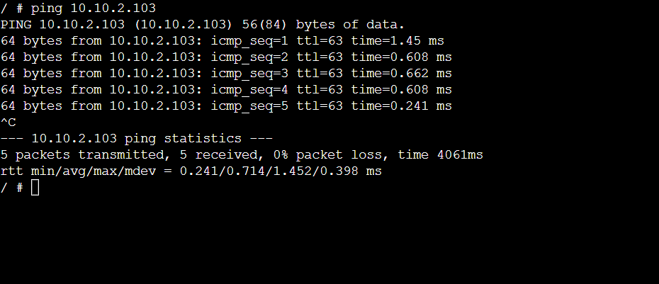
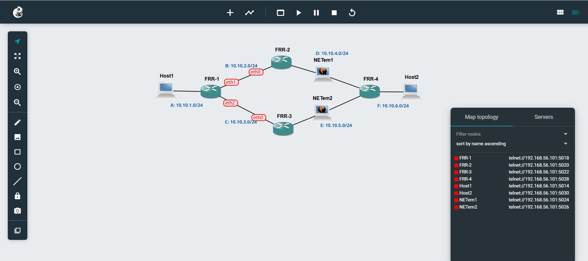
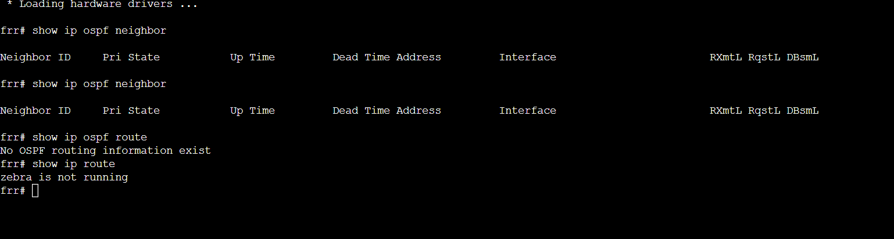

# Week 4
# Routing & OSPF Basics

## Task 1:
-	A network with three hosts and one router was created using two subnets. 
-	IP addresses were set, routing tables were checked, and forwarding was enabled on the router. 
-	Ping was used to test communication between devices.

## Task 2:
-	An OSPF project was used to observe dynamic routing between routers. 
-	Routing information and paths were checked, and when a link was disconnected, the network automatically changed to a new path.

## View Routing Tables

### Project File
- **View-Routes-12268374.gns3project**

### Network Topology

### IP Addresses & Routing Tables

- **Host 1**  

- **Host 2**  

- **Host 3**  

- **Router**  

### Ping Test

---

## OSPF Basics

### Project File
- **OSPF-Basics-12268374.gns3project**

### Network Topology

### Neighbour Routers (FRR1)

