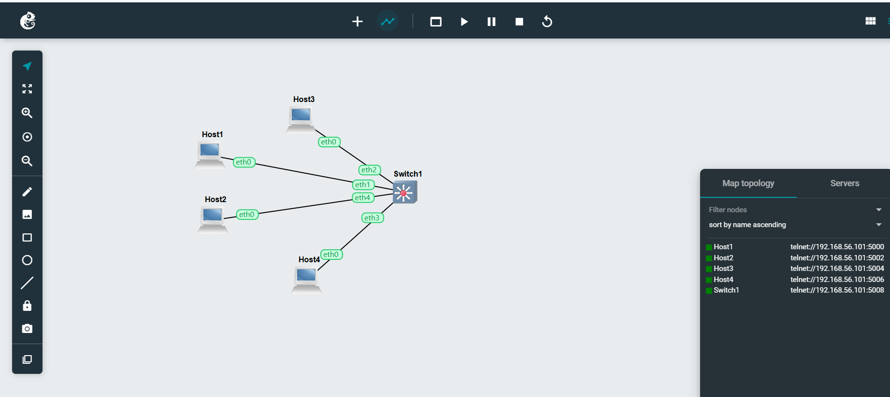
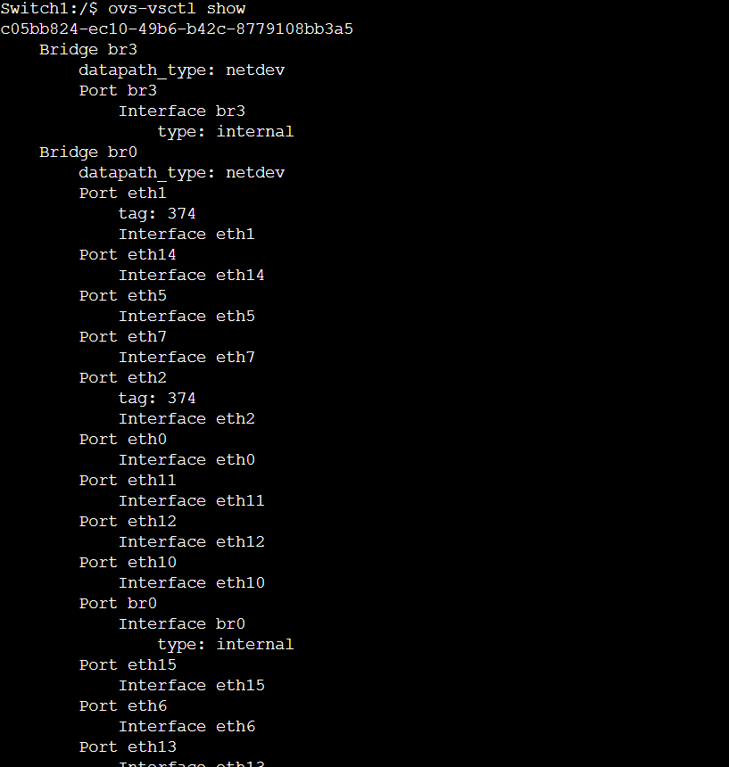
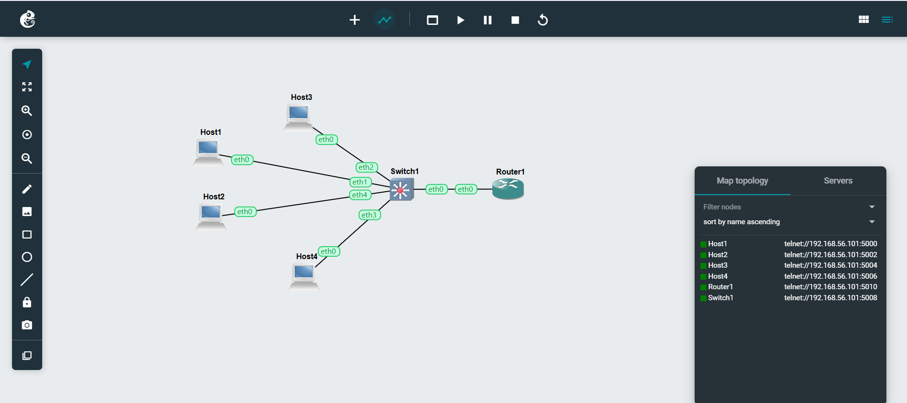
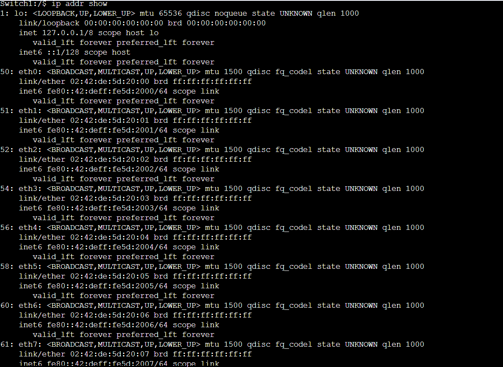

# Week 5
# VLAN Basics & VLAN Routing
## Task 1:
VLANs were configured on a switch by dividing four hosts into two groups. Connectivity was tested before and after applying VLANs, and ARP tables were checked to observe the changes.

## Task 2:
A router was added to enable communication between different VLANs. VLANs and trunk ports were configured, and the router was set up with sub-interfaces so all hosts could communicate across networks.

## VLAN Basics

### Project File
- **Vlan-Basics-12268374.gns3project**

### Network Topology

### Switch Ports & VLAN Tags

---

## VLAN Routing

### Project File
- **Vlan-Router-12268374.gns3project**

### Network Topology

### Switch Ports & VLAN Tags
