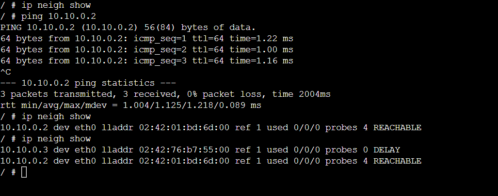
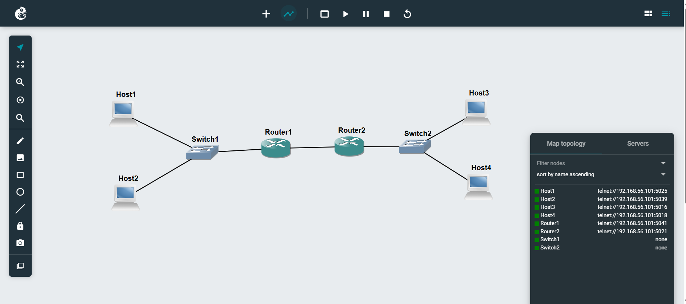
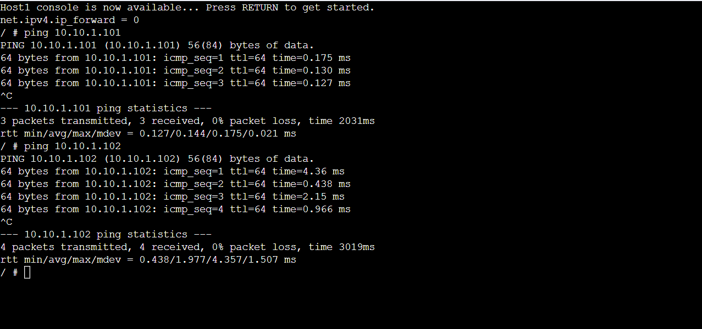

# Week 6
# ARP Basics & Default Gateway
## Task 1:
ARP tables were checked on hosts to observe how IP addresses are mapped to MAC addresses in a LAN. Ping was used between different hosts, and the ARP table was viewed again to see how entries change over time.

## Task 2:
A multi-subnet network was created using two routers, switches, and four hosts. Default gateways were configured on hosts and routing was enabled on routers. Routing tables were checked and ping tests were used to confirm communication between different subnets.

---

## ARP Table Analysis

### ARP Table Changes (Host A)

#### ARP Table

---

## Default Gateway Network

### Project File
- **Default-Gateway-12268374.gns3project**

---

### Network Topology

---

### Cross-Subnet Connectivity Test
